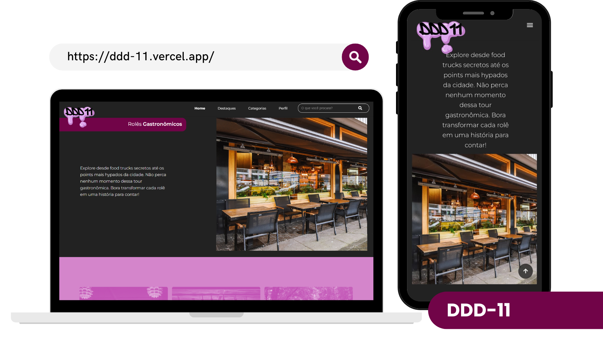

# DDD-11
 
 
 
Plataforma para sugestões de dicas de turismo na cidade de São Paulo. Desenvolvido em um projeto prático na Universidade Anhembi Morumbi pelos alunos:
  

- Amanda Gomes Macêdo

- Enzo Synthes Pinho 

- Erick Firmo Carneiro 

- Gabriel Ricardo da Silva 

- Karina Antunes de Lima 

- Maria Júlia Anacleto Tiago 

- Vitor Hugo Magalhães Marinho
# 
